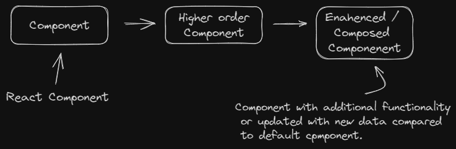
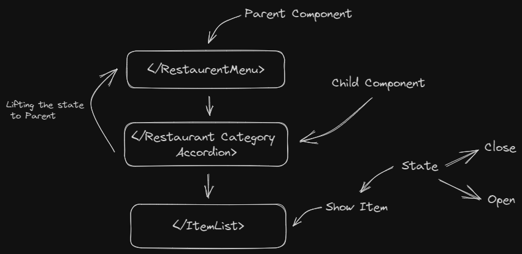
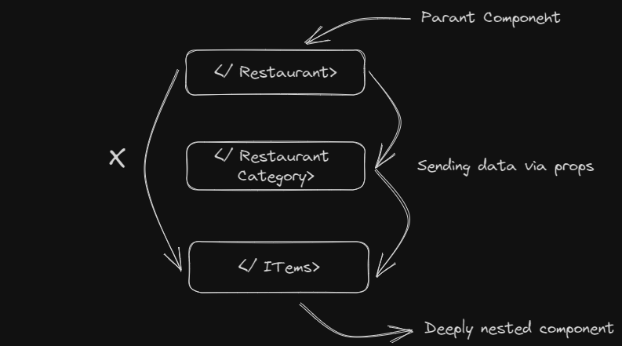

# Episode 11 - Data is the new oil

## Tropic
- Higher Order Components.
- Controlled and Uncontrolled Components.
- Lifting the State up (very important).
- Intro to React Dev Tools.
- Props Drilling.
- React Context.

## NOTES
## Higher Order Component
Higher order components is a function that takes the components and return a enahence components ex.( Restaurent with promoted text)

## [How to Build an Accordion Menu in React from Scratch](https://www.freecodecamp.org/news/build-accordion-menu-in-react-without-external-libraries/)

## Controlled and Uncontrolled component.
 It is common to call a component with some local state `Uncontrolled` . in our project the original `</RestaurantCategoryAccordion>` with and `showItem` state variable is uncontrolled because its parent can't influence whether the `</ItemList>` component is active or not.

 ## Lifting State Up

 In React, sharing state is accomplished by moving it up to the closest common ancestor of the components that need it. This is called “lifting state up”.
 

 ## Props Drilling
 Props drilling means we need to pass some data through several nested child component in order to get that data into some deeply nested component.
 
