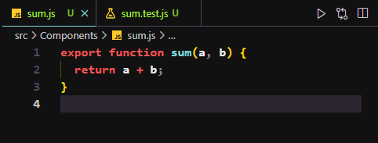
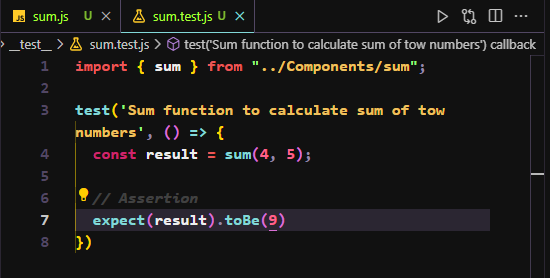
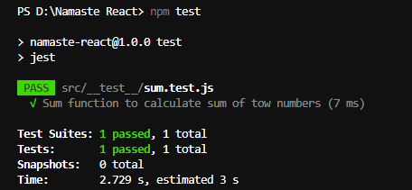
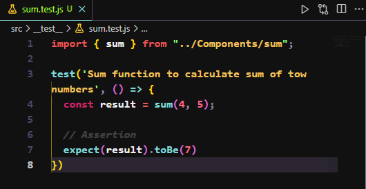
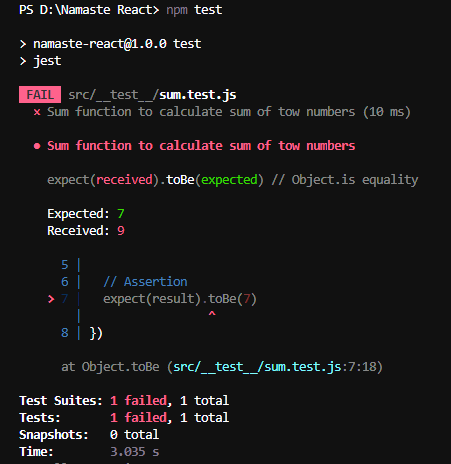

# Episode 13 - Time for the test

## Tropic
- Introduction to Jest, React Testing Library.
- Importance of Testing.
- Types of Testing.
- Setting up our Testing environment.
- Writing basic test cases.
- Explaining Render, Query, Assertion concept.
- Writing Unit Test cases for various components.
- Writing Integration tests for various features.

## NOTES

## Type of Testing (Developer)
- ### Unit Testing
Unit testing is a method of testing that tests the individual software unit in the process of isolation, it means verifying that the component renders for any specific accessory to react component.

- ### Integration Testing
Integration tests test the interaction between the various components of an application.
In React this means testing interaction between React components, typically performed via calling props function such as manipulation of components state.

- ### E2E Testing (End to end Testing)
E2E test means in React application as soon as user lands on the page to the user leavs the application we are testing all the flows. 
like - Clicking buttons, search someting on the site etc. 


- Different tools used in E2E 
    - **Selenium**: An open-source framework that supports multiple languages, browsers, and platforms. Selenium allows testers to write automated test scripts using WebDriver API

    - **Cypress**: A JavaScript-based framework that runs in the browser and enables fast and reliable testing of web applications. Cypress has a built-in test runner, debugger, and dashboard.
    
    - **Appium**: A cross-platform tool that enables automated testing of native, hybrid, and mobile web applications. Appium uses WebDriver protocol to communicate with devices and browsers.

    - **Nightwatch**: A Node.js-based framework that uses W3C WebDriver API to perform E2E tests on web applications. Nightwatch supports custom commands and assertions, as well as integration with popular testing services like BrowserStack and Sauce Labs.
    - **Autify**: A cloud-based platform that allows testers to create, manage, and execute complex test cases without coding. Autify provides extensive test coverage, including visual regression testing and cross-platform testing

## Install React Testing Library.
```
npm install --save-dev @testing-library/react

```    
React testing library uses someting known as **Jest**.
## Installing Jest Library
Jest is a delightful JavaScript Testing Framework with a focus on simplicity.
```
npm install --save-dev jest
```
### Jest using Babel
    
- Install Babel dependencies 

    ```
     npm install --save-dev babel-jest @babel/core @babel/preset-env

    ```
- Configure Babel to target your current version of Node by creating a **babel.config.js** file in the root of your project:
    ```
    module.exports = {
    presets: [['@babel/preset-env', {targets: {node:   'current'}}]],
    };

    ```
- Configure parcel config file to disable default babel transpilation.
To disable Babel transpilation in Parcel, override the default Parcel config for JavaScript to exclude @parcel/transformer-babel.

Create a **.parcelrc** file in the root of your project.

```
{
  "extends": "@parcel/config-default",
  "transformers": {
    "*.{js,mjs,jsx,cjs,ts,tsx}": [
      "@parcel/transformer-js",
      "@parcel/transformer-react-refresh-wrap"
    ]
  }
}
```
### Configure **Jest**:
```
npx jest --init
```
    - JS DOM
    - NO 
    - Instrument code for coverage - Babel
    - Yes
## Test Folder name and Extension of test file.
- Test folder name : **``__test__``** Double underscore called Dunder
- File extension : **.test.js**, **.test.ts**, **.spec.js**, **.spect.js**

## Install JSDOM Library
JSDOM is a library which parses and interact with  assembled HTML just like a browser.

If you're using **Jest 28** or later, jest-environment-jsdom package now must be installed separately.

```
npm install --save-dev jest-environment-jsdom
```
## How to write test cases 
Let's get started by writing a test for a hypothetical function that adds two numbers. First, 
- create a **sum.js** file
  


- Then, create a file named **sum.test.js** This will contain our actual test:
  
  

  - Pass test cases

   

- 2nd Test Cases 
  


  - Test Fail 
  