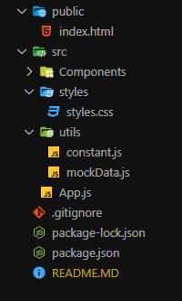

# Episode-5 Let's get hooked

### Stracture of food order app project like Swiggy.

```
Header
 - Logo
 - Nav Items
Body
 - Search
 - RestaurantContainer
 - RestaurantCard
- img
-  Name of Restaurant, rating, cuisines etc.
Footer
 - Copyright
 - Links
 - Address
 - Contact
```

## React App Folder Structure

Assuming you're going to create the next app similar to Swiggy, an ideal folder structure would look like this.



- The structure is organized into an `src` the directory containing the React app's source code.
- The `components` folder contains the React components for the app.
- The `styles` folder contains CSS styles.
- The `utils` folder contains utility functions.
- The `App.js` file contains the root component of the app.
- The `Body.js` the file is responsible for rendering the root component and mounting it to the DOM.
- The `package.json` file lists the dependencies for the project
- The `README.md` the file provides documentation for the project.

### Types of Export/Import

- Default Export/Import
  - ` export default file_name/component from "path" ;`
  - ` import file_name/component from "path" ;`
- Named Export/Import
  - `export const file_name / component ;`
  - `import {file_name / component} from "path"`

## React Hooks

React hooks are a new feature introduced in React 16.8 that allow you to use state and other React features without writing a class. They are functions that "hook into" React state and lifecycle features from function components. Some of the built-in hooks are useState, useEffect, useContext, and useReducer. Hooks make it easier to reuse stateful logic and manage side effects in functional components. You can also create your own custom hooks to extract and share common functionality.

To use hooks, you need to follow some rules:

- Only call hooks at the top level of your function component. Don't call them inside loops, conditions, or nested functions.
- Only call hooks from React function components or custom hooks. Don't call them from regular JavaScript functions or class components.

These rules ensure that hooks work correctly and consistently. You can use the eslint-plugin-react-hooks to enforce these rules automatically.

### React provides a bunch of standard in-built hooks:

- `useState` To manage states. Returns a stateful value and an updater function to update it.
- `useEffect` To manage side-effects like API calls, subscriptions, timers, mutations, and more.
- `useContext` To return the current value for a context.
- `useReducer` A useState alternative to help with complex state management.
- `useCallback` It returns a memorized version of a callback to help a child component not re-render unnecessarily.
- `useMemo` It returns a memoized value that helps in performance optimizations.
- `useRef` It returns a ref object with a current property. The ref object is mutable. It is mainly used to access a child component imperatively. 
- `useLayoutEffect` It fires at the end of all DOM mutations. It's best to use useEffect as much as possible over this one as the useLayoutEffect fires synchronously.
- `useDebugValue` Helps to display a label in React DevTools for custom hooks.

  ### Two most importance hooks

  - ### useState()

    - useState() hook is a function that allows you to add state to your functional component. state is a way of keeping track of data that changes over time in your app. The use state hooks takes an initial value as an arguments and returns an array with two element, the current state value and a function to update it, you can use the state value in your component JSX and call the update function when you want to change the state.

    - How to import useState Hooks from React
      ```
      import { useState } from "react";
      ```

  - ### useEffect()

## [React Reconciliation Algorithm (also knows as React Fiber)](https://github.com/acdlite/react-fiber-architecture)

## Virtual DOM

In simple words, virtual DOM is just a copy of the original DOM kept in the memory and synced with the real DOM by libraries such as ReactDOM. This process is called Reconciliation.

## Diff Algorithm

The diff algorithm basically finds the difference between two doms, the real and virtual, and then re-renders our component.


### References :
- [React Project Folder Stracture](https://scrimba.com/articles/react-project-structure/)
  
- [React Reconciliation Algorithm (also knows as React Fiber)](https://github.com/acdlite/react-fiber-architecture)

- [Reconciliation](https://indepth.dev/posts/1008/inside-fiber-in-depth-overview-of-the-new-reconciliation-algorithm-in-react)

- [Virtual DOM](https://legacy.reactjs.org/docs/faq-internals.html)
- [Diff Algorithm](https://medium.com/@abdellani/how-does-the-diff-algorithm-work-in-react-js-c4296548f84b)