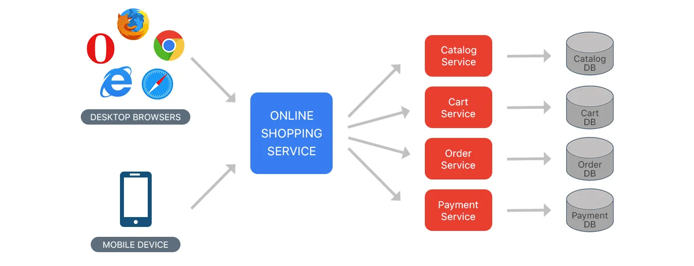
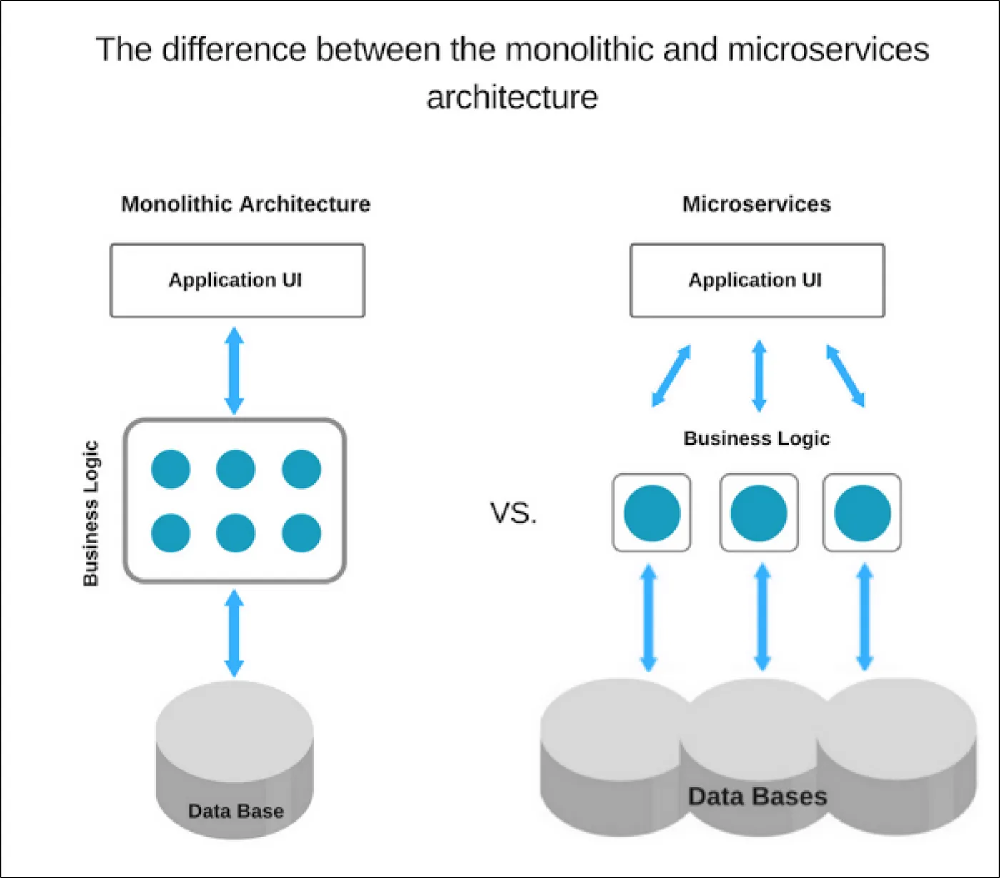

# Episode-6 Exploring the world

## Monolith Architecture

Monolith means composed all in one piece. The Monolithic application describes a single-tiered software application in which different components combined into a single program from a single platform.

- Authorization — responsible for authorizing a user
- Presentation — responsible for handling - HTTP requests and responding with either HTML or JSON/XML (for web services APIs).
- Business logic — the application’s business logic.
- Database layer — data access objects responsible for accessing the database.
- Application integration — integration with other services (e.g. via messaging or REST API). Or integration with any other Data sources.
- Notification module — responsible for sending email notifications whenever needed.

  
### Benefits :

- Simple to develop — At the beginning of a project it is much easier to go with Monolithic Architecture.
- Simple to test. For example, you can implement end-to-end testing by simply launching the application and testing the UI with Selenium.
- Simple to deploy. You have to copy the packaged application to a server.
- Simple to scale horizontally by running multiple copies behind a load balancer.

### Drawbacks :

- Maintenance — If Application is too large and complex to understand entirely, it is challenging to make changes fast and correctly.
- The size of the application can slow down the start-up time.
- You must redeploy the entire application on each update.
- Monolithic applications can also be challenging to scale when different modules have conflicting resource requirements.
- Reliability — Bug in any module (e.g. memory leak) can potentially bring down the entire process. Moreover, since all instances of the application are identical, that bug impact the availability of the entire application
- Regardless of how easy the initial stages may seem, Monolithic applications have difficulty to adopting new and advance technologies. Since changes in languages or frameworks affect an entire application, it requires efforts to thoroughly work with the app details, hence it is costly considering both time and efforts.

## MicroServices Architecture

Microservices are an approach to application development in which a large application is built as a suite of modular services (i.e. loosely coupled modules/components). Each module supports a specific business goal and uses a simple, well-defined interface to communicate with other sets of services.

Instead of sharing a single database as in Monolithic application, each microservice has its own database. Having a database per service is essential if you want to benefit from microservices, because it ensures loose coupling. Each of the services has its own database. Moreover, a service can use a type of database that is best suited to its needs.

Consider the same example of the e-commerce application, which consists of several components/modules. Define each component/module as a separate loosely coupled service depending on the requirement, which may collaborate with each other based on the scenario. We can have following services for a complete application:

 - Authorization Service — Responsible for authorizing customer.
 - Order Service — takes an order and process it.
 - Catalog Service — Manage products and check products inventory.
 -  Cart Service — Manage user cart, this service can utilize Catalog      service as a data source.
 - Payment Service — Manage and Authorize payments.
 - Shipping Service — Ships ordered products.

    

### Benefits:

  - Microservices Enables the continuous delivery and deployment of large, complex applications.
  - Better testability — services are smaller and faster to test.
  - Better deployability — services can be deployed independently.
  - It enables you to organize the development effort around multiple teams. Each team is responsible for one or more single service. Each team can develop, deploy and scale their services independently of all of the other teams.
  - Each microservice is relatively small
  - Comfortable for a developer to understand
  - The IDE is faster making developers more productive
  - The application starts faster, which makes developers more productive, and speeds up deployments
  - Improved fault isolation. For example, if there is a memory leak in one service then only that service is affected. The other services continue to handle requests. In comparison, one misbehaving component of a monolithic architecture can bring down the entire system.
 - Microservices Eliminates any long-term commitment to a technology stack. When developing a new service you can pick a new technology stack. Similarly, when making major changes to an existing service you can rewrite it using a new technology stack.

### Drawbacks:

  - Developers must deal with the additional complexity of creating a distributed system.
  - Developer tools/IDEs are oriented on building monolithic applications and don’t provide explicit support for developing distributed applications.
  - Testing is more difficult as compared to Monolith applications.
  - Developers must implement the inter-service communication mechanism.
  - Implementing use cases that span multiple services without using distributed transactions is difficult.
  - Implementing use cases that span multiple services requires careful coordination between the teams.
  - Deployment complexity. In production, there is also the operational complexity of deploying and managing a system comprised of many different service types.
  - Increased memory consumption. The microservice architecture replaces N monolithic application instances with NxM services instances. If each service runs in its Container, which is usually necessary to isolate the instances, then there is the overhead of M times as many Containers.

### Difference between the Monolith and Microservices Architecture

 

