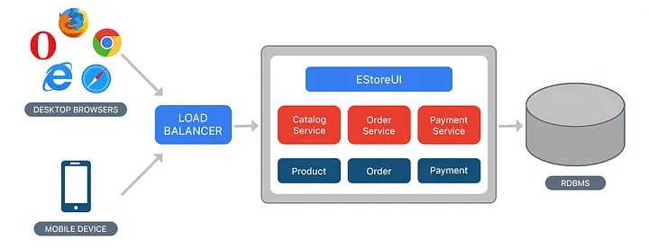

# Episode-6 Exploring the world

## Monolith Architecture

Monolith means composed all in one piece. The Monolithic application describes a single-tiered software application in which different components combined into a single program from a single platform.

- Authorization — responsible for authorizing a user
- Presentation — responsible for handling - HTTP requests and responding with either HTML or JSON/XML (for web services APIs).
- Business logic — the application’s business logic.
- Database layer — data access objects responsible for accessing the database.
- Application integration — integration with other services (e.g. via messaging or REST API). Or integration with any other Data sources.
- Notification module — responsible for sending email notifications whenever needed.

  

### Benefits :

- Simple to develop — At the beginning of a project it is much easier to go with Monolithic Architecture.
- Simple to test. For example, you can implement end-to-end testing by simply launching the application and testing the UI with Selenium.
- Simple to deploy. You have to copy the packaged application to a server.
- Simple to scale horizontally by running multiple copies behind a load balancer.

### Drawbacks :

- Maintenance — If Application is too large and complex to understand entirely, it is challenging to make changes fast and correctly.
- The size of the application can slow down the start-up time.
- You must redeploy the entire application on each update.
- Monolithic applications can also be challenging to scale when different modules have conflicting resource requirements.
- Reliability — Bug in any module (e.g. memory leak) can potentially bring down the entire process. Moreover, since all instances of the application are identical, that bug impact the availability of the entire application
- Regardless of how easy the initial stages may seem, Monolithic applications have difficulty to adopting new and advance technologies. Since changes in languages or frameworks affect an entire application, it requires efforts to thoroughly work with the app details, hence it is costly considering both time and efforts.

## MicroServices Architecture