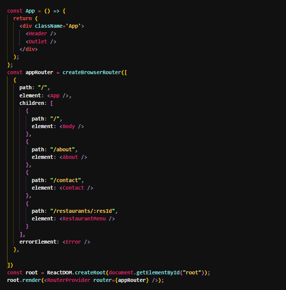

# Episode 07 - Finding the path
## Tropic
- React Router.
- React-router-dom
- useRouteError Hook
- Children Routes
- Outlet Component.
- Link Component
- More about SPA's
- UseParams Hook
- Dynamic Routing
- 2 types of Routing : Client Side Routing & Server-side Routing.
## Routing in React

Configure Router in React App

```
npm i react-router-dom
```

```
import {
  createBrowserRouter,
  RouterProvider, Outlet
} from "react-router-dom";
```

- BrowserRouter configuration



- Link Pages


## Router Provider

`<RouterProvider>` Type declaration All data router objects are passed to this component to render your app and enable the rest of the data APIs.

## Children Routes

using react-router-dom v6, you can use the Outlet component to render a route’s child component inside a parent component1. For example, if you have a Posts component that has child routes for each post, you can write something like this:

```
import { Outlet } from "react-router-dom"

export default function Posts() {
  return (
    <div>
      <h1>List of posts go here!</h1>
      <Outlet /> {/* This will render the child route component */}
    </div>
  )
}

```

## Two types of Routing in web Apps

- client side routing
- Server side routing

### Client side routing

In traditional websites, the browser requests a document from a web server, downloads and evaluates CSS and JavaScript assets, and renders the HTML sent from the server. When the user clicks a link, it starts the process all over again for a new page.

Client side routing allows your app to update the URL from a link click without making another request for another document from the server. Instead, your app can immediately render some new UI and make data requests with fetch to update the page with new information.

This enables faster user experiences because the browser doesn't need to request an entirely new document or re-evaluate CSS and JavaScript assets for the next page. It also enables more dynamic user experiences with things like animation.

Client side routing is enabled by creating a Router and linking/submitting to pages with `Link` and `<Form>`

### Dynamic Routing

Dynamic routing is a feature of React Router that allows you to create routes based on the parameters in the URL. For example, you can have a route like /restaurants/:id that will match any URL that starts with /restaurants/ and has a variable id after it. You can then access the id value in your component and use it to fetch data or render different content.

```
import {useParams} from "react-router-dom"

const {resId} = useParam();
```


### References


- [React Router](https://reactrouter.com/en/main)
