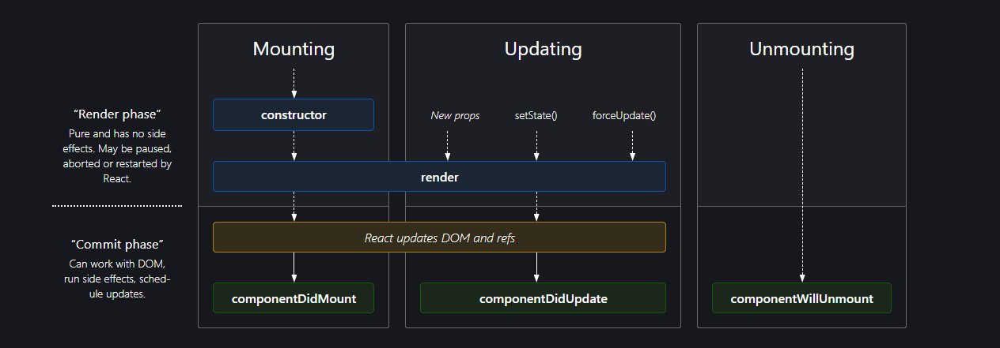

# Episode 8 Let's get Classy

## Class based Component

When creating a React component, the component's name must start with an upper case letter.

The component has to include the extends React.Component statement, this statement creates an inheritance to React.Component, and gives your component access to React.Component's functions.

The component also requires a render() method, this method returns HTML.

```
import React from "react";

class userClass extends React.Component(){
  render(){
    return(
      <div>
      <h1>Hello Class</h1>
      </div>
    )
  }
}
```

## How Props was define in class Components

```
import React from "React"

class userClass extends React.Component{

  constructor(props){
  super(props)
  }

  render(){
    return(
      <div>
      <h1>Name: {this.props.name}</h1>
      </div>
    )
  }
}
```
## Why do we use `super(props)` in constructor?
`super(props)` is used to inherit the properties and access of variables of the React parent class when we initialize our component.
super() is used inside constructor of a class to derive the parent's all properties inside the class that extended it. If super() is not used, then Reference Error : Must call super constructor in derived classes before accessing 'this' or returning from derived constructor is thrown in the console.
The main difference between super() and super(props) is the this.props is undefined in child's constructor in super() but this.props contains the passed props if super(props) is used.
## State & SetState in class component

```
import React from "React"

class userClass extends React.Component{
constructor(props){
super(props);

    this.state = {
      count: 0,
    }

}
render(){
    return(
        <div>
            <h1>{this.state.count}</h1>
            <button onclick={() => {
              this.setState({
              count: this.state.count + 1,
              })
            }}>Click</button>
        </div>
      )
    }
}
```

## ComponentDidMount()
The `componentDidMount()` method allows us to execute the React code when the component is already placed in the DOM (Document Object Model). This method is called during the Mounting phase of the React Life-cycle i.e after the component is rendered.
Wwe can run any piece of react code to modify the components. For ex. It's the best place to `make API calls`.

## Why do we use `componentWillUnmount`? Show with example.
`componentWillUnmount()` is useful for the cleanup of the application when we switch routes from one place to another. Since we are working with a SPA(Single Page Application) the component process always runs in the background even if we switch to another route. So it is required to stop those processes before leaving the page. If we revisit the same page, a new process starts that affects the browser performance.
For example, in Repo class, during `componentDidMount()` a timer is set with an interval of every one second to print in console. When the component is unmounted (users moves to a different page), the timer will be running in the background, which we might not even realize and causing huge performance issue. To avoid such situations the cleanup function can be done in componentWillUnmount, in this example `clearInterval`(timer) to clear the timer interval before unmounting Repo component.

## React Lifecycle Methods (Class Component)

Parent Constructor => Parent Render => Child Constructor => Child Render => componentDidMount(Child) => ComponentDidMount(Parent)




## Reference
- [React Lifecycle Methods](https://projects.wojtekmaj.pl/react-lifecycle-methods-diagram/)

